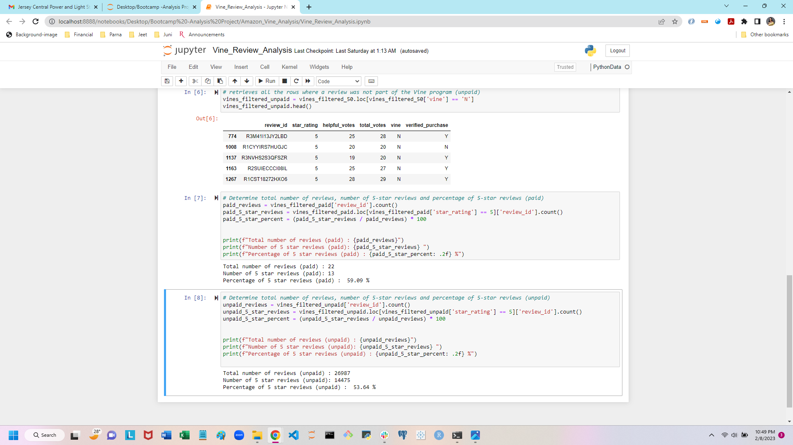

# Amazon_Vine_Analysis

## Overview of the Analysis

The purpose of the project is to analyze Amazon reviews written by members of the paid Amazon Vines program. The Amazon Vine program is a service that allows manufacturers and publishers to receive reviews for their products.

The reviews are stored a dataset in AWS S3 buckets. PySpark is used to perform the ETL process to extract the dataset, transform the data and split it into 4 dataframes ready to be loaded, connect to a AWS RDS instance and finally load the data into tabble using pgAdmin.

Then Pandas is used to furthere analyze the data and determine if there is a bias towards favorable reviews from Vine.

## Results

*   How many Vine reviews and non-Vine reviews were there?

    There are a total of 1,174 Vine review and a total of 1,320,622 non-Vine review

*   How many Vine reviews were 5 stars? How many non-Vine reviews were 5 stars?
    
    480 of the Vine review were 5-stars and 745,254 non-Vine reviews were 5 stars.

*   What percentage of Vine reviews were 5 stars? What percentage of non-Vine reviews were 5 stars?

    40.89% of the Vine reviews were 5 stars and 56.43% of the non-Vine reviews were 5 stars.

## Summary

40.89 % of the Vines review are 5 stars whereas 56.43 % of the non-Vines reviews are 5 stars. Since the Vines percentage is quite less than the non-Vines, it can be concluded that there is no bias for reviews in the Vines program.

Since the sample of Vines review is considerably smaller, all non-zero votes can be taken into the analysis to detrmine the percentage of 5 star reviews.